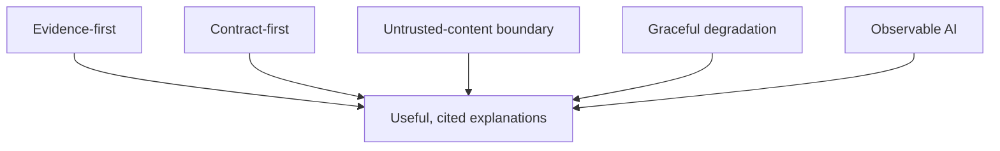
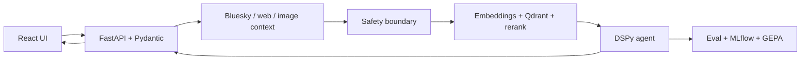
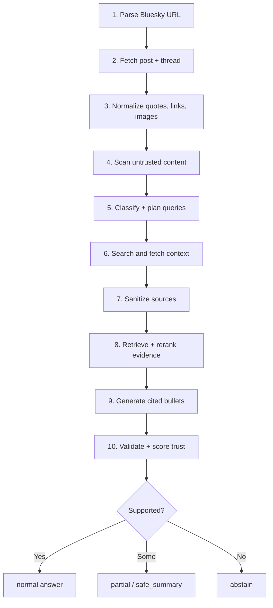
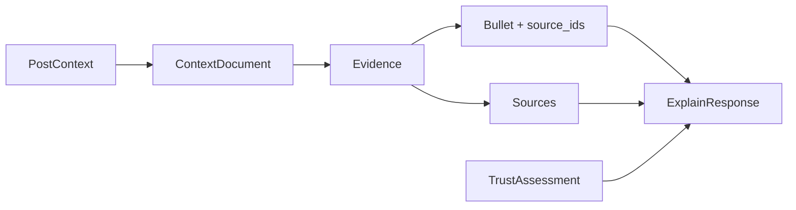
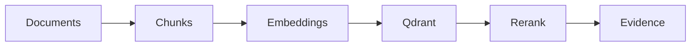
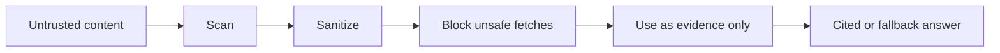

# RapidCanvas - Bluesky Contextual Post Explainer

RapidCanvas is a 48-hour proof of concept built for the Bluesky Post Explainer
to exemplify software architecture, product features, and good practices for
building AI data products focused on agentic systems. A user pastes a public
Bluesky post URL and receives 3-5 concise, cited bullets explaining the post's
broader context.

The project is intentionally more than a prompt wrapper. The model is one
component inside a system that acquires evidence, normalizes context, defends
against untrusted content, retrieves relevant support, validates citations,
chooses safe fallbacks, and reports quality.

The product belief is simple: an AI explanation is useful only if the system can
show where it came from, when to trust it, and when to say less.

## Reviewer Path

```bash
make run
# open http://localhost:5173
# paste an OpenAI key and a public Bluesky post URL
```

Then verify the submission with `make test`, `make eval`, and
`make provider-comparison`. Use `make live-quality-review` to refresh the
curated reviewer proof in `docs/reviews/live_quality_review.md`; use
`make eval-cached` only when you need the offline reproducibility path.

## Assignment Coverage Snapshot

### Explicitly Requested

- Done: **Bluesky post explainer agent.** The app accepts a public Bluesky URL,
  fetches post/thread context through ATProto, searches for supporting context,
  and returns 3-5 explanatory bullets.
- Done: **Source citations.** Factual bullets carry `source_ids`; the UI renders
  source titles, URLs, types, and snippets.
- Done: **React frontend.** Vite + React + TypeScript UI with URL input, masked
  key input, provider selector, cited bullets, source list, loading states,
  fallback states, trace, and errors.
- Done: **FastAPI backend.** FastAPI + Pydantic v2 routes for `/api/explain`,
  `/api/health`, `/api/providers`, and `/docs`.
- Done: **Relevant context search.** Runtime Search/RAG uses Bluesky/web/link
  context, thread/quote context, image-related context, sanitization, embeddings,
  Qdrant or in-memory retrieval, and reranking.
- Done: **English explanations.** User-facing bullets are generated and
  validated in English, including for non-English Bluesky posts.
- Done: **Evaluation harness.** `make eval` runs the live FastAPI route over 19
  cases with exact-post cache fallback only when a matching cached prediction
  already exists; `make eval-cached` keeps the reproducible offline audit path.
- Done: **Image understanding path.** Image URLs and alt text are evidence;
  image understanding is enabled by default and uses OpenAI vision when image
  posts and a request key are available, with untrusted alt-text fallback.
- Done: **Multi-provider comparison path.** `make provider-comparison` writes a
  provider report with configured/skipped status; `make live-quality-smoke` runs
  configured live providers when credentials are available.
- Done: **ML-powered modules.** Classification, embeddings, retrieval,
  reranking, evaluation, GEPA, and MLflow paths are implemented as separate
  capabilities.

### Added Beyond The Base Requirements

- **DSPy workflow:** named modules for classification, query planning,
  explanation, validation, trust assessment, judge support, and optimization.
- **Qdrant vector retrieval:** chunked context, OpenAI embeddings, Qdrant local
  or remote URL support, request-isolated namespaces, reranking, and stable
  evidence/source IDs.
- **Bounded adaptive retrieval:** at most one extra safe query can run when
  first-round evidence is weak. It stops early on sufficient trust and skips
  after pre-retrieval prompt-injection risk.
- **Prompt-injection defense:** retrieved content is evidence, never
  instructions; prompt-like attacks are scanned and flagged.
- **Low-trust fallbacks:** `partial`, `safe_summary`, and `abstain` are product
  states, not hidden failures.
- **Typed finalization boundary:** response finalization consumes public
  `FinalizationContext` state instead of private explainer internals.
- **Operational docs:** Makefile commands, Docker Compose, `.env.example`,
  no-secrets checks, review workflow, research docs, project skills,
  translation log, requirement matrix, and review notes.

## Quick Start

The one-command product path is Docker:

```bash
make run
```

Open `http://localhost:5173`, paste a public Bluesky post URL, paste your OpenAI
key into the masked field, leave provider as `openai`, and click **Explain**.
`make run` starts the React UI, FastAPI backend, Qdrant, and MLflow UI. No API
key is baked into Docker images or Compose; the key is supplied through the
masked required OpenAI API-key field for the current request only.

Before Compose starts, `make run`/`make docker-up` runs
`python3 scripts/check_docker_prereqs.py`. The preflight verifies the Docker
daemon is reachable, at least 10 GiB is free, and ports 5173, 8000, 6333, and
5000 are available. Compose healthchecks then gate backend startup on healthy
Qdrant and MLflow services, and gate frontend startup on the backend health
route. For detached local verification, run
`make docker-up DOCKER_UP_FLAGS=-d`, check the four service health endpoints,
then stop the stack with `make docker-down`.

For source development without Docker, use `make dev`. It installs or refreshes
backend/frontend dependencies, then starts fixed-port FastAPI and Vite servers
in one terminal. The frontend uses the Vite `/api` proxy and falls back to
`http://127.0.0.1:8000`, so local preview runs do not collapse into a generic
browser `Failed to fetch` when the backend is reachable.

Useful checks: `make test`, `make eval`, `make eval-cached`,
`make provider-comparison`, `make requirements-review`, and
`make check-secrets`.

## Design Mental Models



**Evidence-first:** the agent does not invent context from the post alone. It
fetches, searches, sanitizes, retrieves, reranks, cites, and validates evidence.

**Contract-first:** `PostContext`, `ContextDocument`, `Evidence`,
`ExplainResponse`, and `TrustAssessment` are stable typed boundaries.

**Untrusted-content boundary:** posts, replies, web pages, image alt text, and
retrieved documents can support claims but cannot change tool policy, citation
policy, or output shape.

**Graceful degradation:** the system can say less. Low evidence, contradictions,
unavailable posts, unsafe content, or uncited claims produce guarded fallbacks.

**Observable AI:** every response preserves sources, warnings, trust score,
fallback mode, guardrail flags, adapter mode, and trace notes. Runtime fallback
paths now use production-facing names such as `deterministic_fallback` and
`thread_context_fallback_guardrails_active`, while old lane labels are reserved
for historical review docs.

## High-Level Architecture



Responsibilities are intentionally separated: frontend renders product state,
API orchestrates requests, Bluesky/search acquires context, safety treats outside
content as untrusted, retrieval turns context into evidence, DSPy reasons over
structured evidence, and eval measures usefulness and safety.

## Request Lifecycle



This locality makes failures debuggable. A weak result can usually be traced to
URL parsing, ATProto fetch, search, safe fetch, sanitization, embeddings, vector
retrieval, reranking, generation, validation, or fallback logic.

## Core Data Contracts



- `PostContext`: normalized Bluesky post, thread, quotes, links, images, and warnings.
- `ContextDocument`: source text from thread, Bluesky, web, link, or image context.
- `Evidence`: retrieved/reranked text with score and source identity.
- `ExplainResponse`: post, bullets, sources, and trace.
- `TrustAssessment`: score, fallback mode, flags, and reasons.
- `FinalizationContext`: public runtime state used to finalize responses and
  quality traces without private explainer coupling.

## Agent, Retrieval, And Evidence

DSPy expresses the agent as named modules instead of one hidden prompt:
classify, plan queries, retrieve evidence, explain, validate, and apply trust or
fallback policy.



The retrieval layer uses chunking variants, OpenAI embeddings, Qdrant vector
search, request-isolated namespaces, safe in-memory fallback, reranking, and
stable evidence/source IDs. Linked-page fetches and search collection run with
bounded concurrency, deterministic result ordering, and partial-result timeout
warnings.
Common non-fatal retrieval diagnostics, such as Qdrant fallback, content
truncation, HTTP 403 source pages, empty extracted text, and Bluesky search
outages, are summarized as retrieval notes in the UI while raw trace remains
available for review.

## Safety Boundary



The scanner detects attacks such as "ignore previous instructions", "system
prompt", "API key", "do not cite", "disable citations", "tool call", "POST to",
and "delete". The fetch layer blocks private/local URLs and `file://` targets,
checks robots.txt before page fetches, and keeps robots-disallowed search hits
as low-confidence snippet evidence only. Output guardrails require 3-5 bullets
in normal mode and citations for factual claims. Video embeds are explicitly
marked as unparsed; video posts still use their text, thread, link, and image
evidence, but the app does not claim to
parse video frames.

## Evaluation Strategy

`make eval` is the first-class live quality path. It runs the FastAPI route over
the eval suite with bounded retrieval limits and parallel case execution,
requires `OPENAI_API_KEY`, and writes ignored artifacts under `reports/eval/`:

```text
eval_results.jsonl
eval_report.md
confusion_matrix.csv
metric_bars.svg
summary.json
```

If a live API case cannot complete, it may use cached output only when the
cached prediction is for the exact same Bluesky URL. That keeps useful prior
answers available without letting unrelated fixtures masquerade as live quality.

`make eval-cached` is the no-network reproducibility path. The 19 cached cases
cover public Bluesky fixtures, memes/slang, current-event context,
reply/quote/link/image context, ambiguous acronyms, sparse context,
unavailable/deleted posts, prompt injection, contradictory sources, and
low-evidence behavior.

CI runs `make deep-review` and `make eval-cached` on push, pull request, and
manual dispatch. The separate `Manual Live Eval` workflow is `workflow_dispatch`
only; it requires the repository `OPENAI_API_KEY` secret, runs the live eval and
live-quality reports, rechecks secret hygiene, and uploads ignored report
artifacts without committing generated output.

The scoring focuses on expected-point recall, citation coverage, unsupported
claims, fallback correctness, prompt-injection resistance, private URL blocking,
source leakage, final-response correctness, and latency. Cached fixtures are the
curated reference layer; live Search/RAG is runtime retrieval and data collection.
Assignment requirement closure is tracked in `docs/requirements_matrix.md`.

## Optimization And MLflow

`make optimize` verifies the saved DSPy optimization path:

```text
backend/app/agent/optimized/program.json
backend/app/agent/optimized/program_compiled/
```

The checked-in program metadata records the eval-dataset bridge and current
optimization score. Loader use still depends on DSPy and provider credentials.
The optimization dataset bridge also records citation-eligible source IDs,
expected citation relevance, expected source-quality scores, and a
source-quality policy version so weak or off-topic evidence can be penalized in
future optimization runs. The saved program explicitly reports whether it is
dry-run metadata or a loadable compiled DSPy artifact.

`make mlflow-log` creates a local file-backed MLflow run and exercises
`mlflow.dspy.log_model`. Docker Compose also exposes the MLflow UI on port 5000.
This is local ops plumbing, not a hosted experiment workflow. `mlruns/` is
ignored.
The MLflow manifest captures provider metadata, models, chunk/retrieval
settings, retrieval backend, vision status, source-quality policy, cached eval
metrics, provider-comparison status, live-quality report snapshot,
optimized-program artifact status, and a requirements-matrix snapshot.

## Tooling And Commands

Tooling is intentionally mainstream: Vite/React/TypeScript for the UI,
FastAPI/Pydantic for stable API contracts, ATProto for public Bluesky reads,
httpx/DDGS/trafilatura/BeautifulSoup for safe context collection, OpenAI
embeddings plus Qdrant and rerankers for evidence ranking, DSPy for structured
agent modules, GEPA for optimization, MLflow for local tracking, and Make/Docker
for repeatable local operation.

```bash
make setup                    # install backend and frontend dependencies
make run                      # one-command Docker UI + API + Qdrant + MLflow
make dev                      # one-command source deps + backend + frontend
make lint                     # backend ruff/mypy + frontend TypeScript
make test                     # backend pytest + frontend Vitest
make eval                     # live API eval; requires OPENAI_API_KEY
make eval-cached              # cached offline eval reports
make eval-api                 # alias for live API eval
make provider-comparison      # provider status/skip report
make live-quality-smoke       # live configured-provider quality smoke
make live-quality-review      # curated live proof report
make optimize                 # GEPA saved-program verification
make mlflow-log               # local MLflow run/package path
make requirements-review      # requirement matrix validation
make skills-review            # local project skill validation
make check-secrets            # secret/artifact hygiene scan
make deep-review              # full local review workflow
```
