# RapidCanvas - Bluesky Contextual Post Explainer

RapidCanvas is a production-shaped AI data product built in a 24-hour delivery window. A user pastes a public Bluesky post URL and receives 3-5 concise, cited bullets explaining the post's broader context.

The project is intentionally more than a prompt wrapper. The model is one component inside a system that acquires evidence, normalizes context, defends against untrusted content, retrieves relevant support, validates citations, chooses safe fallbacks, and reports quality.

The product is built around a simple belief: an AI explanation is only useful if the system can show where it came from, when to trust it, and when to say less.

## Assignment Coverage Snapshot

### Explicitly Requested

- Done: **Bluesky post explainer agent.** The system accepts a public Bluesky post URL, fetches post/thread context through ATProto, searches for supporting context, and returns 3-5 explanatory bullets.
- Done: **Source citations.** Factual bullets carry `source_ids`, and the UI renders source titles, URLs, types, and snippets so claims can be inspected.
- Done: **React frontend.** Built with Vite, React, TypeScript, Vitest, and Testing Library; includes URL input, provider selector, cited bullets, source list, loading states, and error states.
- Done: **FastAPI backend.** Built with FastAPI and Pydantic v2 contracts; exposes `/api/explain`, `/api/health`, `/api/providers`, and `/docs`.
- Done: **Relevant context search.** The pipeline supports Bluesky search, web search, linked-page fetch, thread context, quote context, link context, and image-related context.
- Done: **Evaluation harness.** Includes 12+ eval cases, expected outputs, cached/no-network mode, live refresh path, deterministic metrics, JSONL/Markdown/summary report support, and confusion-matrix/graph support.
- Done: **README/setup/design documentation.** Includes setup commands, architecture, eval methodology, design decisions, limitations, guardrails, and security notes.
- Done: **Image understanding path.** Image URLs and alt text are collected; vision can be enabled, with alt-text fallback when vision is unavailable.
- Done: **Multi-provider comparison path.** OpenAI is the default provider, while the provider layer is designed to support Anthropic, Gemini, and local Ollama-style backends through configuration and explicit provider status.
- Done: **ML-powered modules.** Classification, embeddings, retrieval, reranking, and evaluation are implemented as separate system capabilities rather than hidden inside one prompt.

### Added Beyond The Base Requirements

- Done: **Structured agent workflow.** DSPy signatures/modules separate classification, query planning, explanation, validation, trust assessment, judge support, and optimization hooks.
- Done: **Qdrant vector retrieval.** Context is normalized into `ContextDocument` objects, chunked, embedded with OpenAI embeddings, indexed in Qdrant, searched by vector similarity, and reranked into `Evidence`.
- Done: **Prompt-injection defense.** External content is scanned for instruction-overriding patterns such as "ignore all instructions," "do not cite," "system prompt," and API-key exfiltration language.
- Done: **Low-trust fallbacks.** The system can return `partial`, `safe_summary`, or `abstain` when evidence is weak, contradictory, unsafe, unavailable, or uncited.
- Done: **Private/local URL protection.** The fetch layer blocks localhost, private IP ranges, link-local targets, and `file://` URLs.
- Done: **Source sanitization and extraction pipeline.** Linked pages are fetched safely, extracted with trafilatura/BeautifulSoup, stripped of unsafe content, capped, and preserved with source identity.
- Done: **Traceability and observability.** Responses include trace fields, warnings, trust score, fallback mode, guardrail flags, adapter/provider status, sources, and snippets.
- Done: **GEPA optimization path.** Eval feedback can be used to optimize the DSPy program, with a saved-program loader that falls back safely to the baseline.
- Done: **MLflow support path.** Evaluation parameters, metrics, artifacts, provider metadata, optimized program snapshots, and requirement-matrix snapshots can be logged when the environment is configured.
- Done: **Operational handoff.** Includes Makefile commands, `.env.example`, `.gitignore`, no-secrets checks, deep-review workflow, research docs, task packets, project skills, translation log, and requirement matrix.

## Key Decisions And Trade-Offs

- **Used ATProto instead of scraping Bluesky.** This keeps the integration cleaner, read-only, and closer to the platform contract.
- **Used DSPy instead of a single prompt.** The agent is decomposed into named modules, which makes classification, query planning, explanation, validation, judge support, and optimization inspectable and testable.
- **Implemented Qdrant as the vector retrieval layer.** Source context is chunked, embedded, indexed, queried by vector similarity, and reranked before generation. Qdrant gives the project a real vector-search architecture while keeping setup lightweight enough for reviewers to run locally.
- **Designed providers as a configurable abstraction.** OpenAI is the default path, but the provider layer is not hardwired to one model vendor. Optional providers report configured/skipped status explicitly, which makes comparison and environment limitations auditable.
- **Used cached eval as the default.** Live social/web data changes; cached fixtures make quality reproducible. Live refresh remains explicit.
- **Implemented guardrails at the data boundary.** Posts, pages, image text, and retrieved documents are untrusted evidence. They never become instructions.
- **Preferred honest fallback over fake certainty.** Low evidence or unsafe evidence produces `partial`, `safe_summary`, or `abstain`.
- **Made evaluation visible.** The project reports expected-point recall, citation coverage, unsupported claims, fallback behavior, prompt-injection resistance, private URL blocking, and latency where available.
- **Documented skips and limitations instead of hiding them.** If Ragas, MLflow, live search, or provider comparison cannot run in the local delivery environment, the report should say exactly why.
- **Protected secrets despite the assignment mentioning an attached `.env`.** The key belongs only in local `.env`; `.env`, API keys, MLflow runs, Qdrant cache, and generated live artifacts are not committed.
- **Added requirement-level closure.** `docs/requirements_matrix.md` maps assignment requirements to implementation, tests, eval artifacts, docs, and status so the submission does not rely on vague claims.

## Quick Start

```bash
make setup
cp .env.example .env
# Add OPENAI_API_KEY locally. Do not commit .env.
```

Run the backend and frontend:

```bash
make dev
```

Or run them separately:

```bash
make dev-backend
make dev-frontend
```

Run validation:

```bash
make test
make eval
make requirements-review
make check-secrets
```

Optional quality and operations commands:

```bash
make optimize
make mlflow-log
make mlflow-ui
make deep-review
```

The backend exposes `GET /api/health`, `GET /api/providers`, `POST /api/explain`, and `/docs`. The React app runs through Vite and proxies `/api` to the FastAPI backend.

## 1. Product At A Glance

RapidCanvas turns an isolated social post into an explainable, source-supported answer. The visible output is compact, but the system preserves the evidence trail behind it: source IDs, snippets, warnings, trust score, fallback mode, and guardrail flags.

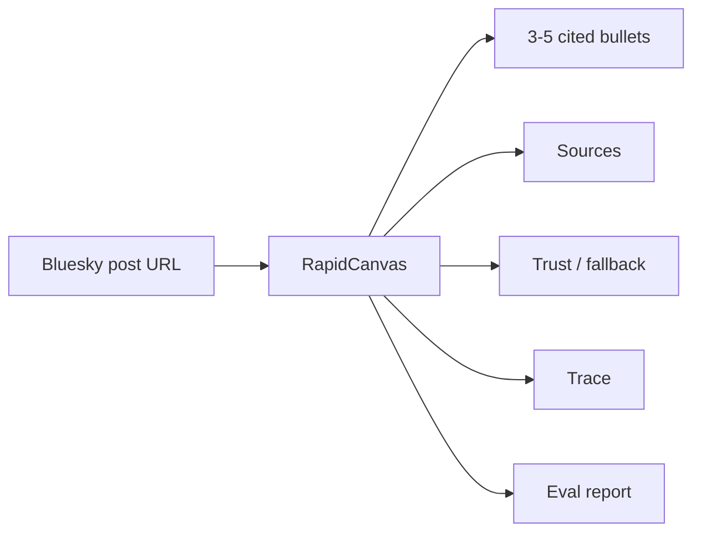

The product goal is not to maximize answer length. It is to maximize supported context. When evidence is strong, the system explains. When evidence is weak, contradictory, unavailable, or unsafe, it returns `partial`, `safe_summary`, or `abstain`.

## 2. Design Mental Models

RapidCanvas is organized around five engineering mental models that shaped the implementation.

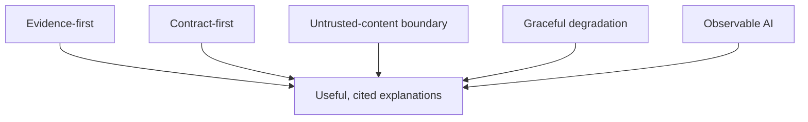

**Evidence-first:** the agent does not invent context from the post alone. It fetches, searches, sanitizes, retrieves, reranks, and cites evidence before generating the explanation.

**Contract-first:** the system uses explicit Pydantic contracts instead of loose dictionaries and prompt-shaped strings. `PostContext`, `ContextDocument`, `Evidence`, `ExplainResponse`, and `TrustAssessment` are stable boundaries between modules.

**Untrusted-content boundary:** posts, replies, web pages, image alt text, and retrieved documents are data, not instructions. They can support claims, but they cannot change tool policy, citation policy, or output shape.

**Graceful degradation:** the system is allowed to say less. `partial`, `safe_summary`, and `abstain` are first-class product states, not errors.

**Observable AI:** every response is designed to be inspectable through citations, source IDs, warnings, fallback mode, guardrail flags, and eval artifacts.

## 3. High-Level Architecture

This is the simplest view of the system: UI, API, context acquisition, safety boundary, retrieval, agent, and quality layer.

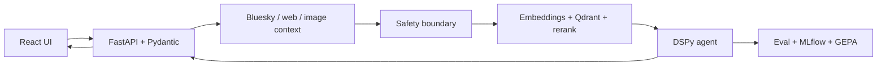

This architecture separates responsibilities cleanly:

- the frontend renders the product state
- the API orchestrates the request
- the Bluesky/search layer acquires context
- the safety layer treats outside content as untrusted
- the retrieval layer turns context into evidence
- the DSPy agent reasons over structured evidence
- the eval layer measures whether the system is useful and safe

## 4. Request Lifecycle

The detailed runtime flow is still easy to follow because each step has one job.

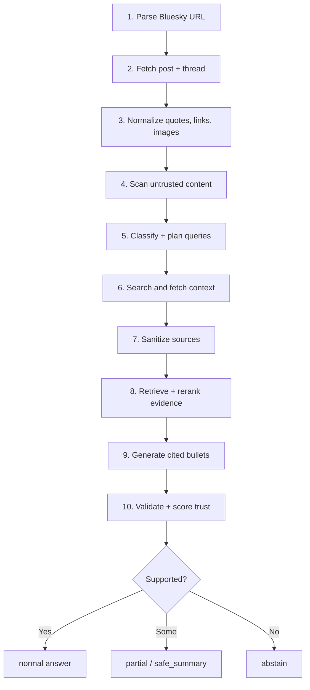

This makes failures local. A bug or weak result can usually be traced to URL parsing, ATProto fetch, search, safe fetch, sanitization, embeddings, vector retrieval, reranking, generation, validation, or fallback logic.

That locality is the difference between a debuggable AI system and an opaque prompt.

## 5. Core Data Contracts

The system keeps evidence structured from ingestion to response.

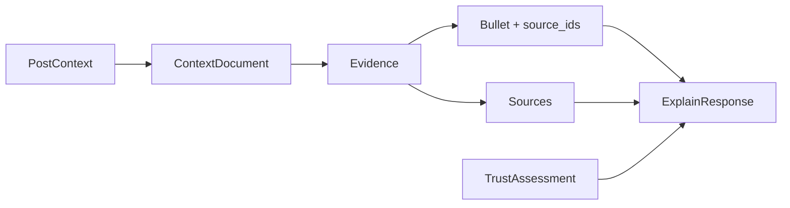

The important contracts are:

- `PostContext`: normalized Bluesky post, thread, quotes, links, and image metadata
- `ContextDocument`: normalized source text from thread, Bluesky, web, link, or image context
- `Evidence`: retrieved/reranked text with score and source identity
- `ExplainResponse`: post, bullets, sources, and trace
- `TrustAssessment`: score, fallback mode, flags, and reasons

This makes the UI, eval harness, and guardrails much easier to reason about. A bullet can be checked against its `source_ids`; a source can be traced to its URL; eval can measure citation coverage without parsing prose.

## 6. Agent Workflow

DSPy is used to express the agent as a set of named modules instead of one hidden prompt. That was a deliberate architecture choice: named modules are easier to test, optimize, replace, and review.

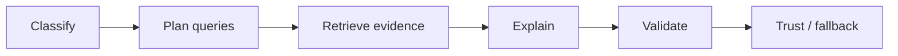

The DSPy workflow includes signatures/modules for:

- classifying the post context
- generating search queries
- reranking evidence
- generating explanation bullets
- validating citations and output shape
- assessing trust and fallback mode
- supporting judge/eval workflows

This gives the agent a clean internal protocol: classify what kind of context is needed, search for it, explain only from evidence, validate the result, and degrade safely when support is weak.

## 7. Retrieval And Evidence

Retrieval is where the system earns better explanations than a simple prompt call.

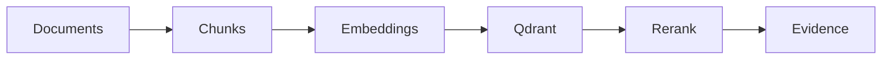

The retrieval layer uses:

- chunking variants for different context lengths
- OpenAI embeddings for semantic matching
- Qdrant vector search over indexed evidence chunks
- reranking to improve final evidence ordering
- stable evidence/source IDs for traceability

This matters because social posts often rely on implicit context: a meme, a quote post, a linked article, a niche phrase, a current event, or a reply chain. Retrieval lets the system find that context before the model writes.

## 8. Safety Boundary

The safety layer is built around a practical assumption: internet content is not just noisy; it can be adversarial.

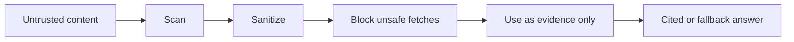

The system scans for prompt-injection phrases such as:

- "ignore previous instructions"
- "ignore all instructions"
- "system prompt"
- "developer message"
- "API key"
- "do not cite"
- "disable citations"
- "tool call"
- "POST to"
- "delete"

It also blocks private/local URL fetches, strips unsafe HTML/script content, caps source length, and prevents retrieved text from becoming tool commands.

The key rule is simple: external content can support an answer, but it cannot control the agent.

## 9. Feature Highlights

### React frontend

The UI renders the complete product state: URL input, provider selection, loading/error states, cited bullets, citation chips, source list, trace panel, trust score, fallback mode, and guardrail flags.

It intentionally does not invent frontend-only quality logic. The backend owns trust and safety decisions; the frontend makes those decisions understandable.

### FastAPI backend

The backend exposes:

- `POST /api/explain`
- `GET /api/health`
- `GET /api/providers`
- `/docs`

The route layer stays thin and typed. It coordinates services, maps failures, and returns schema-valid responses.

### Bluesky integration

The ATProto client uses public read-only APIs. It handles URL parsing, handle/DID resolution, AT URI construction, post/thread fetch, quotes, links, images, alt text, and deleted/unavailable warnings.

No Bluesky write APIs are exposed.

### Image understanding

Image posts are handled as an evidence channel. The system collects image URLs and alt text, can call vision when enabled, and degrades to alt text when vision is unavailable.

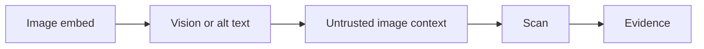

Image-derived text follows the same safety rule as web text: useful as evidence, never trusted as instructions.

### Multi-provider support

The provider registry exposes configured and skipped providers. OpenAI is the default path. Optional providers such as Anthropic, Gemini, and Ollama can be enabled when configured.

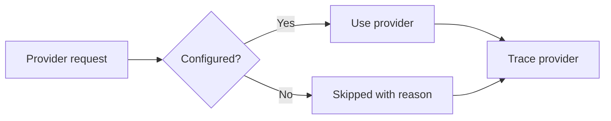

This makes provider comparison auditable instead of mysterious.

### GEPA optimization

GEPA is included as the DSPy optimization path. The idea is to use eval feedback to improve the program systematically instead of manually tweaking prompts forever.

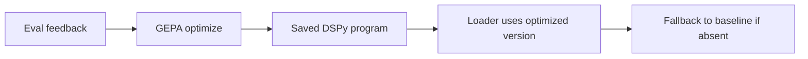

The feedback loop can target missed expected points, weak citation coverage, unsupported claims, prompt-injection failures, and incorrect fallback behavior. The optimized program is additive: the baseline remains available.

### MLflow tracking

MLflow support makes evaluation runs inspectable as ML artifacts.

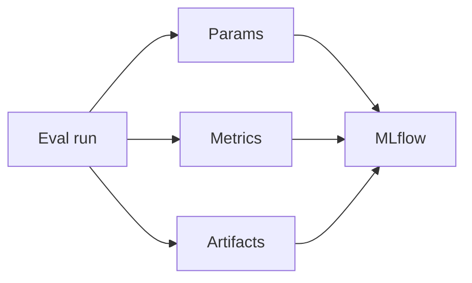

The intended run logs provider/model settings, chunking, reranker, dataset hash, guardrail versions, recall, citation coverage, hallucination/unsupported claim counts, latency, prompt-injection resistance, reports, graphs, optimized program, and requirement matrix snapshots.

If MLflow cannot run in the local delivery environment, the report documents the exact reason instead of pretending success.

## 10. Evaluation Strategy

The eval harness is built around the questions that matter for a contextual explainer.

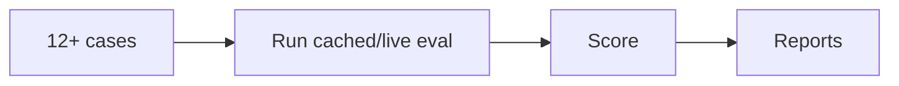

The cases cover:

- niche references
- memes and slang
- current/news-like context
- reply context
- quote context
- link context
- image context
- ambiguous acronyms
- adversarial false premises
- sparse context
- non-English posts
- unavailable/deleted posts
- prompt-injection attempts
- contradictory sources
- low-evidence cases

The scoring focuses on practical quality:

- did the answer recover expected points?
- were factual claims cited?
- did it avoid unsupported claims?
- did low-trust cases fallback correctly?
- did prompt-injection attempts fail to change policy?
- were private/local URLs blocked?
- was latency captured?
- were failures visible?

Cached mode is default for reproducibility. Live mode is explicit because social/web data changes.

## 11. Tooling Map

| Layer | Tools | Why They Were Used |
|---|---|---|
| Frontend | Vite, React, TypeScript | Fast typed UI for URL input, citations, trace, sources, fallbacks |
| Frontend tests | Vitest, Testing Library | Tests user-visible behavior rather than implementation details |
| Backend API | FastAPI | Async API, clear routes, OpenAPI docs |
| Contracts | Pydantic v2 | Stable schemas for requests, responses, evidence, trace, trust |
| Settings | pydantic-settings | `.env`-driven configuration without hardcoded secrets |
| Bluesky | ATProto SDK | Official public read-only post/thread/search access |
| HTTP/testing | httpx, respx, pytest | Async clients and deterministic mocked boundary tests |
| Agent | DSPy | Structured agent modules instead of opaque prompt blobs |
| Embeddings | OpenAI embeddings | Semantic retrieval over post/thread/web context |
| Vector DB | Qdrant | Real vector search over embedded context chunks |
| Reranking | DSPy reranker / optional cross-encoder | Better evidence ordering before generation |
| Extraction | trafilatura, BeautifulSoup | Robust text extraction from linked pages |
| Safety | scanner, sanitizer, SSRF guard | Keeps untrusted content inside the evidence boundary |
| Evaluation | cached/live runner, metrics, reports | Reproducible measurement of usefulness, citations, safety |
| Optimization | GEPA | Feedback-driven DSPy program improvement path |
| Tracking | MLflow | Params, metrics, artifacts, model/program metadata |
| Ops | Makefile, requirement matrix, deep review, secret check | Repeatable workflow and delivery confidence |

## 12. Developer Experience

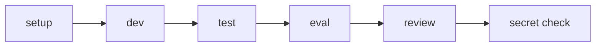

Common commands:

```bash
make setup
cp .env.example .env
# Add OPENAI_API_KEY locally. Do not commit .env.

make dev
make test
make eval
make requirements-review
make check-secrets
```

Optional quality and ops commands:

```bash
make optimize
make mlflow-log
make mlflow-ui
make deep-review
```

The repo also includes research notes, task packets, local project skills, a requirement matrix, a translation log, a deep review workflow, secret-safety rules, and ignored generated artifacts. That gives a reviewer the implementation plus the thinking and evidence around it.

## 13. Why This Is More Than A Minimal Submission

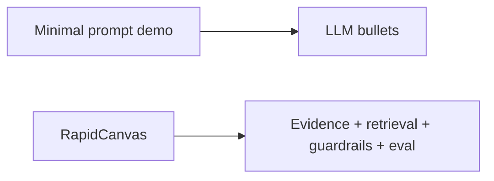

A minimal version could paste a post into an LLM and ask for three bullets. RapidCanvas builds the surrounding system that makes those bullets more trustworthy:

- read-only source acquisition
- normalized post/thread/link/image context
- explicit evidence objects
- semantic retrieval
- reranking
- citation enforcement
- prompt-injection defense
- private URL blocking
- low-trust fallbacks
- traceability
- cached evals
- adversarial fixtures
- metrics and reports
- MLflow and GEPA support paths
- requirement-level closure

The result is compact enough for a two-day assignment, but shaped like a real AI product: contracts, evidence, safety boundaries, eval loops, operational discipline, and clear extension paths.
